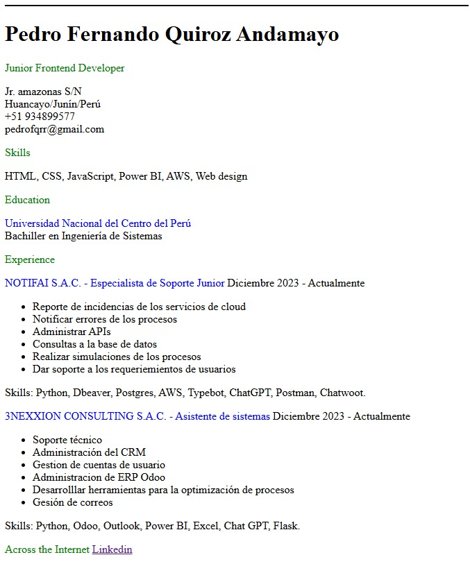

# 📄 Single-Page CV en HTML

Este proyecto es un CV en una sola página desarrollado únicamente con **HTML**. Permite mostrar información profesional de manera sencilla y accesible sin necesidad de CSS o JavaScript adicionales.

# 🚀 Características

- Estructura simple y ligera.
- Contiene metadatos optimizados para SEO y redes sociales.

## 📸 Vista Previa

  

# Tecnologias usadas

- HTML5
- Metadatos para SEO y Open Graph

👨‍💻 Autor
Pedro Fernando Quiroz Andamayo
📧 pedrofqrr99@gmail.com
🔗 https://www.linkedin.com/in/pedro-fernando-quiroz-andamayo-008a96217/

https://roadmap.sh/projects/single-page-cv